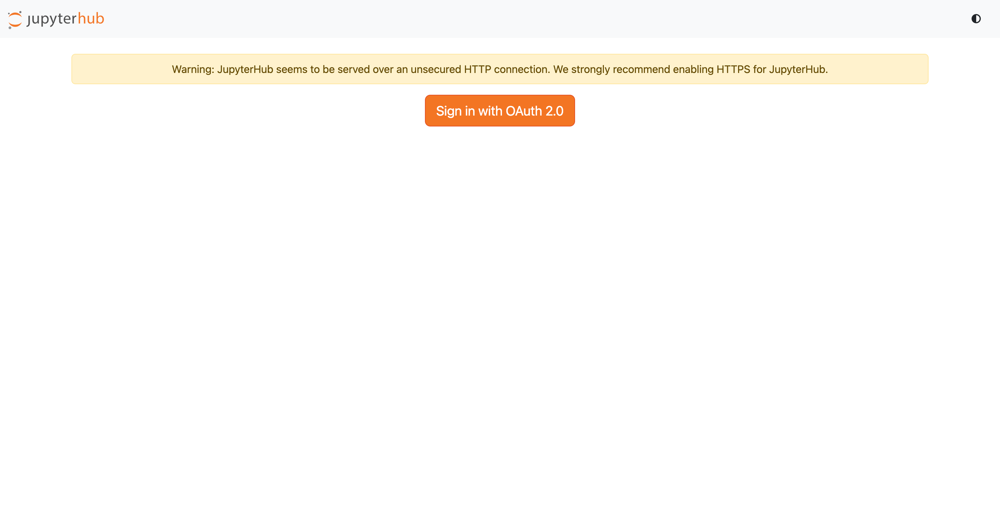
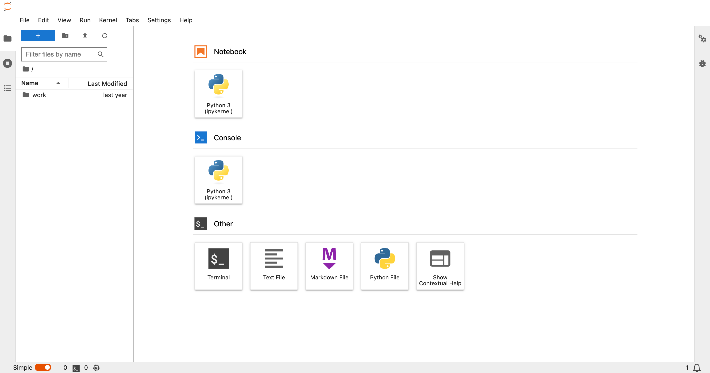

# Jupyterhub

JupyterHub là một hệ thống mã nguồn mở giúp nhiều người dùng có thể truy cập và sử dụng các môi trường Jupyter Notebook hoặc JupyterLab riêng biệt thông qua trình duyệt web.

Giao diện sau khi đăng nhập SSO thành công

